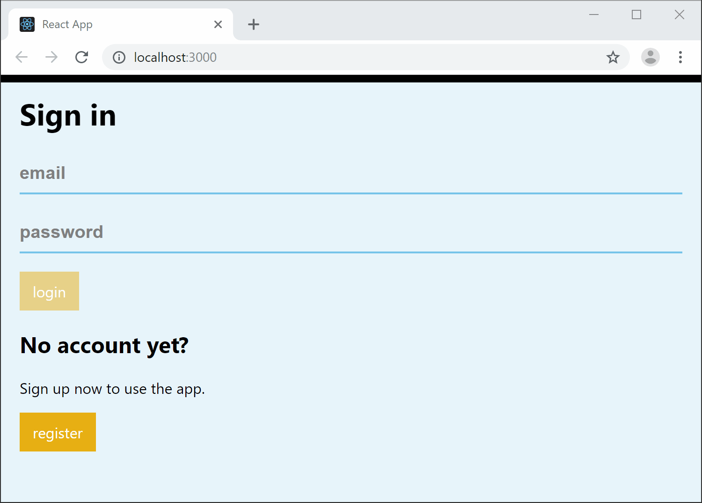

# Learn how to build a simple react app

New to React and looking for a free course?

Learn step by step how to build your own React app:
- Complete guide to components, props, state, hooks, events, forms, and many more.
- Integration with Firebase: cloud database, authentication without the need for any back end code.
- Step by step guide.
- New lessons added every month.
- Free!

Demo:
[https://cb-simple-react-app.firebaseapp.com/](https://cb-simple-react-app.firebaseapp.com/)

Edit and run in codesandbox:
[https://codesandbox.io/s/github/TomBina/Simple-React-App/tree/master](https://codesandbox.io/s/github/TomBina/Simple-React-App/tree/master)

Screenshot:

## Start learning

Visit [https://www.coolbytes.io/a-complete-guide-to-react](https://www.coolbytes.io/a-complete-guide-to-react) for an overview.

All lessons:

- [Building your first React component](https://www.coolbytes.io/post/1244/building-your-first-react-component)
- [Adding routing to React](https://www.coolbytes.io/post/1245/adding-routing-to-react)
- [Using components and props](https://www.coolbytes.io/post/1246/using-components-and-props)
- [Understanding state and component lifecycle](https://www.coolbytes.io/post/1247/understanding-state-and-component-lifecycle)
- [Managing state with hooks](https://www.coolbytes.io/post/1248/managing-state-with-hooks)
- [Working with events](https://www.coolbytes.io/post/1249/working-with-events)
- [Form validation using custom hooks](https://www.coolbytes.io/post/1250/form-validation-using-custom-hooks)
- [Integrate React with Firebase](https://www.coolbytes.io/post/1251/integrate-react-with-firebase)
- [Building custom hooks for Firebase](https://www.coolbytes.io/post/1252/building-custom-hooks-for-firebase)
- [Securing your app with Firebase auth](https://www.coolbytes.io/post/1253/securing-your-app-with-firebase-auth)
- [Sharing data with the Context API](https://www.coolbytes.io/post/1254/sharing-data-with-the-context-api)

Are you missing a lesson about a specific topic? Then [submit an issue](https://github.com/TomBina/Simple-React-App/issues/new) or 
[become an author](https://www.coolbytes.io/contact).